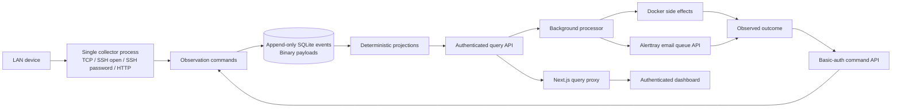

# Event model

The reference project separates commands, stored facts, replayed state and external processors. This implementation keeps those boundaries while moving the listener/CQRS runtime into Python, where one process can own all network ports. Next.js is the authenticated observation UI.



## Slices

| Trigger / actor | Command | Facts appended | Read model | Next actor |
| --- | --- | --- | --- | --- |
| TCP accept | Record observation | `ConnectionOpened` | Sessions | Protocol adapter |
| Socket read/write | Record bytes | `BytesCaptured` | Session byte totals / events | Dashboard |
| SSH decoded message | Record packet | `SshPacketCaptured` | Events / downloadable payloads | Dashboard |
| SSH authentication | Record attempt | `AuthenticationAttempted` | Session username / event detail | SSH adapter |
| SSH shell/exec | Record request | `SshShellRequested`, `SshCommandRequested` | Session event stream | Container exec adapter |
| Docker exec begins / emits / ends | Record interaction | `ContainerSessionStarted`, `TerminalBytesCaptured`, `ContainerSessionEnded` | Terminal event stream | Dashboard |
| HTTP request / body / response | Record request details | `HttpRequestReceived`, `HttpBodyReceived`, `HttpTrailersReceived`, `HttpResponseSent` | Session request count / event stream | Dashboard |
| Malformed input / refused feature | Record failure | `HttpProtocolError`, `HttpRequestMalformed`, `SshRequestDenied`, `ConnectionError`, `SshSessionFailed` | Event stream | Dashboard |
| Limit reached | Record limit | `CaptureLimitReached`, `ConnectionClosed` | Closed session | Collector closes connection |
| Collector boot / due health check | Request reconciliation | `ContainerReconcileRequested` | Pending container work | Processor |
| Docker inspected/repaired | Record reconciliation result | `ContainerReconcileCompleted` | Container health / next due time | Processor on next cycle |
| Connection ends | Record closure | `ConnectionClosed` | Closed session / duration | Dashboard |
| Collector restart | Recover open sessions | `ConnectionClosed` with unknown end time | Sessions | Dashboard |
| Collector startup / config change | Configure email notifications | `EmailNotificationsConfigured` | Email settings and source cursor | Processor |
| New connections accumulated and interval due | Prepare email notification | `EmailNotificationRequested` | Email outbox with immutable message snapshot | Processor |
| Due outbox batch | Claim email notification | `EmailNotificationAttemptStarted` | Attempt ID and lease expiry | Processor calls Alerttray |
| Alerttray accepts email | Record email result | `EmailNotificationAccepted` | Accepted receipt, provider ID, channel | Dashboard |
| API failure / expired attempt | Record email result | `EmailNotificationFailed` | Retry time, final failure or routing pause | Processor / dashboard |

## Container sequence

```mermaid
sequenceDiagram
    participant C as Collector
    participant E as Events / projections
    participant P as Processor
    participant D as Docker
    C->>E: ContainerReconcileRequested
    P->>C: GET container-work (Basic processor)
    C-->>P: pending request_id
    P->>D: Inspect labeled sandbox
    alt Missing
        P->>D: Create with fixed isolation policy
        P->>D: Start
    else Stopped
        P->>D: Start
    else Unhealthy
        P->>D: Restart
    end
    P->>D: Inspect health
    P->>C: POST record-container-reconciled
    C->>E: ContainerReconcileCompleted + read-model update
    C-->>P: status / next_check
    Note over P,E: Failures are facts; retries have bounded exponential delay.
```

SSH container exec is an interaction adapter, just as a network response is a side effect of its protocol adapter. The lifecycle processor exclusively manages container creation/start/restart/health; the observation command handlers themselves only append facts. Both adapters report into the same event store.

## Email sequence

```mermaid
sequenceDiagram
    participant C as Collector commands
    participant E as Events / email outbox
    participant P as Processor
    participant A as Alerttray
    C->>E: ConnectionOpened
    P->>C: Prepare email notification (Basic processor)
    C->>E: EmailNotificationRequested + advance source cursor
    P->>C: Query email-work
    C-->>P: Next due batch
    P->>C: Claim batch with attempt UUID
    C->>E: EmailNotificationAttemptStarted + 60s lease
    P->>A: POST notifications/push (X-API-Key, medium)
    A-->>P: Queue receipt or error
    P->>C: Record email result (Basic processor)
    C->>E: EmailNotificationAccepted or EmailNotificationFailed
    Note over P,A: Acceptance is not SMTP confirmation; lost receipts can cause duplicate retries.
```

Email settings contain no access token. Enabling records the current source sequence so historical events are not sent. Batch preparation atomically snapshots exact connection totals, up to ten examples, and the message, then advances the cursor. Extra connections accumulate while one batch is unfinished. The outbox, cursor, leases and receipts all rebuild from events without invoking Alerttray. Docker work and notification work each get a processor cycle even if the other raises an error.

## Storage and consistency

* Each session UUID is an aggregate stream. `sandbox` is the lifecycle aggregate; `system` stores collector facts. Aggregate versions are assigned under a single writer lock and protected by a unique `(stream, version)` constraint.
* SQLite WAL with `synchronous=FULL` persists the event and projection changes atomically. Queries use the same serialized connection so they do not read partial command updates.
* The projection checkpoint advances in the same transaction. Startup catches up any missing projection entries. `--replay` clears only query tables and applies every event in global sequence order.
* Docker work is **at least once**. A crash after Docker succeeds and before posting the result leaves the request pending. Reconciliation safely inspects/adopts the already-created container on retry. This cannot promise a perfect audit of an external effect if the processor dies before reporting it.
* A processor lock permits one worker per data directory. A collector lock permits one writer process. This is a single-host design, not a distributed worker lease system.
* Commands reject stale container outcomes. Completion IDs derive from request IDs, preventing duplicate completion facts for retries of the same request. A replay reuses the recorded `next_check` time rather than recalculating it.
* Binary payloads stay in the event table. Query list responses return metadata, lengths and hashes; payload retrieval is a separate authenticated query. Global sequence cursors support full event-history navigation without loading every BLOB.
* UTC event times are observation times on the host clock. Byte offsets are per layer, direction and terminal stream. Global event order reflects serialized observation commits; it does not claim packet arrival ordering across CPU threads.

## Module boundaries

| Module | Responsibility |
| --- | --- |
| `telemetry/main.py` | Bind listeners in one process; connection admission and lifetime; recovery and shutdown. |
| `telemetry/capture.py` | Record socket reads/writes, offsets, payload limits, and peer metadata. |
| `telemetry/ssh.py`, `telemetry/web.py` | Protocol adapters and structured observations. |
| `telemetry/commands.py` | Validate command state and append facts. |
| `telemetry/store.py` | Immutable events, hash chain, projections and queries. |
| `telemetry/api.py` | HTTP Basic identities, command routing and query routing. |
| `telemetry/processor.py` | Poll work, invoke external work, report outcomes through HTTP commands. |
| `telemetry/alerttray.py` | Build bounded connection summaries, call Alerttray with X-API-Key, validate email-only receipts and sanitize provider errors. |
| `telemetry/docker.py` | Fixed Docker policy, lifecycle reconciliation and exec streaming. |
| `telemetry/peers.py` | Passive neighbor cache; nullable MAC attribution. |
| `nextjs-app/lib/auth.ts` | Admin authentication and signed sessions. |
| `nextjs-app/app/api/telemetry` | Authenticated read-only query proxy. |
| `nextjs-app/app/dashboard.tsx` | Live activity, session/event navigation, safe payload inspection. |
